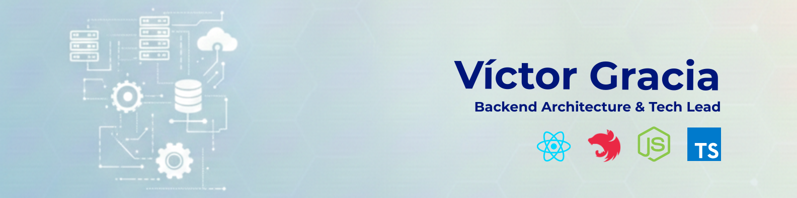
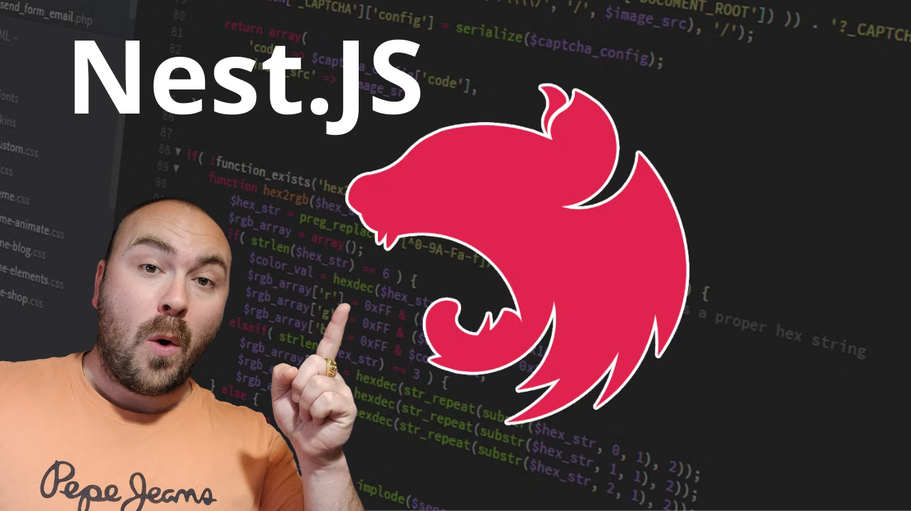

# Hola, mi nombre es Víctor Gracia 👋

### Backend Architecture & Tech Lead

Ayudo a equipos técnicos a diseñar e implementar sistemas backend escalables, tomando decisiones estratégicas de arquitectura y guiando la implementación crítica. Experto en Node.js, NestJS, microservicios, sistemas orientados a eventos, Solidity y blockchain.

Soy Tech Lead y Arquitecto de Backend con más de 13 años de experiencia, ayudando a empresas a diseñar y escalar sistemas backend y blockchain, alineando la arquitectura con los objetivos de negocio.

Lidero equipos técnicos, tomo decisiones estratégicas de arquitectura y brindo orientación en la definición de productos digitales complejos, asegurando escalabilidad, seguridad y eficiencia.

Principales áreas de expertise: Arquitectura limpia, microservicios, Node.js, NestJS, Solidity, React y sistemas orientados a eventos (Kafka, RabbitMQ).

Trabajo con clientes B2B de manera remota, apoyando iniciativas de transformación digital, acelerando el desarrollo de productos y fortaleciendo procesos técnicos y arquitectónicos.

## Sígueme en Redes Sociales:

 

## Curso Desarrollo Backend con NestJS

## Algunos vídeos en mi canal de YouTube:

<table style="width:100%">
<tr>
<td>

</td>
<td>

</td>
<td>

</td>
</tr>
<tr>
<td>

</td>
<td>

</td>
<td>

</td>
</tr>
</table>
