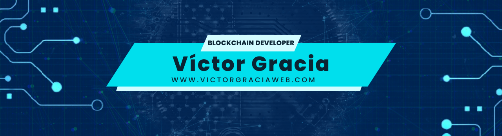

# Hola, mi nombre es Víctor Gracia 👋
### Blockchain Developer (Freelance)

Soy desarrollador de Software desde hace más de 10 años.

Consultor en transformación digital para empresas desarrollando todo tipo de productos digitales implementando para ello tecnologías Blockchain & web y metodologías ágiles de trabajo como Scrum. 👉 👉 👉 info@victorgraciaweb.com

## Sígueme en Redes Sociales:

 

 

 

 

 

 

## Curso Desarrollo Backend con NestJS

